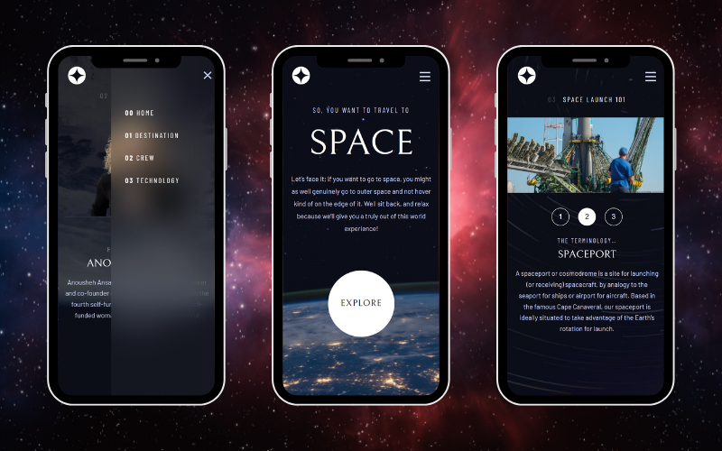
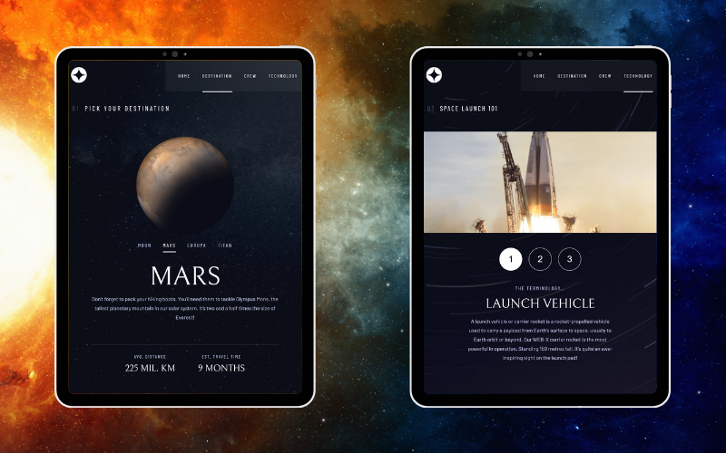
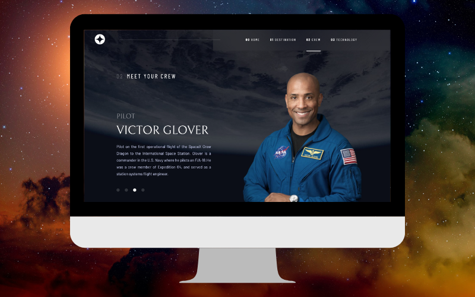

# Space tourism website

This is a solution to the [Space tourism website challenge on Frontend Mentor](https://www.frontendmentor.io/challenges/space-tourism-multipage-website-gRWj1URZ3).

## Table of contents

- [Overview](#overview)
  - [Features](#features)
  - [Screenshot](#screenshot)
  - [Links](#links)
  - [Built with](#built-with)
  - [Useful resources](#useful-resources)
- [Author](#author)

## Overview

### Features

Users should be able to:

- View the optimal layout for each of the website's pages depending on their device's screen size.
- See hover states for all interactive elements on the page.
- View each page and be able to toggle between the tabs to see new information.

### Screenshot

***Mobile***

 

***Tablet***

 

***Desktop***

 

### Links

- Live Site URL: [Space-Tourism-Website](https://hugoriveros18.github.io/space-tourism-website/)

## My process

### Built with

- Semantic HTML5 markup
- CSS custom properties
- Flexbox
- [Vue.js](https://vuejs.org/) - JS framework

### Useful resources

- [Vue.js documentation](https://vuejs.org/guide/introduction.html) - I found beneficial the official documentation from Vue.js which allow me to reinforce my knowledge of some concepts and build a reactive web page in an easier way.
- [Developer Mozilla](https://developer.mozilla.org/es/docs/Web/CSS) - As usual, one of the best documentation around web development, in this case, helped me especially with CSS styles that I need to make my page look great.

## Author

- Frontend Mentor - [@hugoriveros18](https://www.frontendmentor.io/profile/hugoriveros18)
- Twitter - [@HugoRiverosF18](https://www.twitter.com/HugoRiverosF18)

